# 🖥️ Instalador de Controlador de Dominio 
 

**📑 Índice**
- [🖥️ Instalador de Controlador de Dominio](#️-instalador-de-controlador-de-dominio)
  - [🖥️ 1. Configuración de la Máquina](#️-1-configuración-de-la-máquina)
    - [⚙️ 1.1 Requisitos Necesarios](#️-11-requisitos-necesarios)
  - [🌐 2. Configuración del Dominio](#-2-configuración-del-dominio)
    - [🚦 2.1 Primer Paso](#-21-primer-paso)
    - [🏗️ 2.2 Instalar Dominio raíz](#️-22-instalar-dominio-raíz)
  - [✅ 3. Comprobaciones](#-3-comprobaciones)

 

## 🖥️ 1. Configuración de la Máquina
 

### ⚙️ 1.1 Requisitos Necesarios
 

1 - 💻 Sistema:

Es importante conocer los requisitos mínimos del sistema para el servidor. En este caso, la cantidad de ``RAM`` es fundamental para un funcionamiento óptimo del Controlador de Dominio y los servicios asociados.

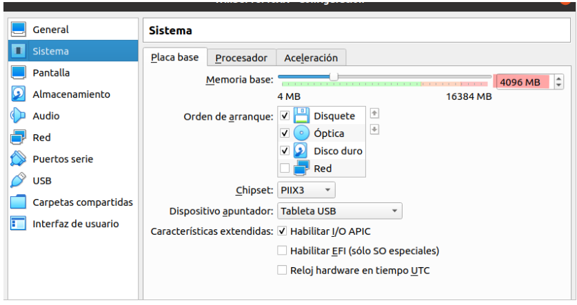
  

2 - 🏷️ Nombre de Máquina: 

Asignar un nombre único y descriptivo a la máquina es fundamental para su identificación en la red. Este nombre debe ser claro para facilitar la administración y evitar conflictos en la red.

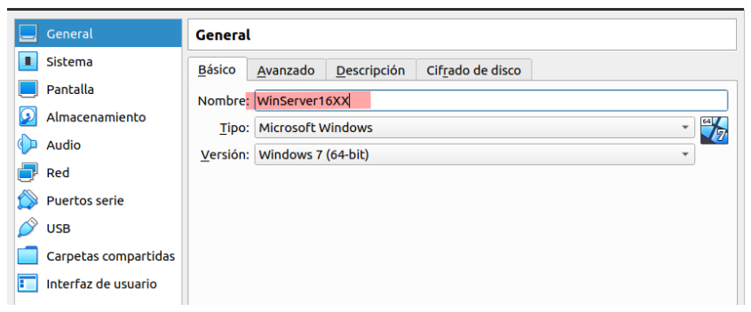
  

3 -  💾 Almacenamiento: 

Configura un disco con al menos ``100GB`` para alojar el sistema operativo, servicios y datos del dominio. Es importante reservar suficiente espacio para el crecimiento futuro.

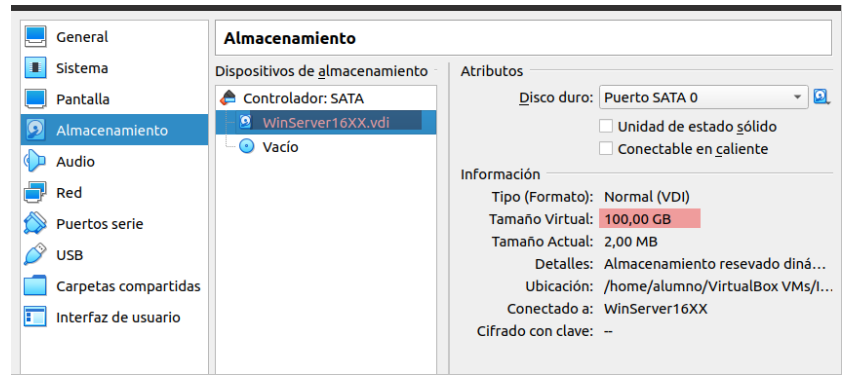
  

4 - 🌐 Crear red NAT:

Para conectar la máquina virtual al entorno de red y permitir su comunicación, es necesario crear una red ``NAT (Network Address Translation)``. Esto facilita el acceso al servidor desde otros dispositivos.

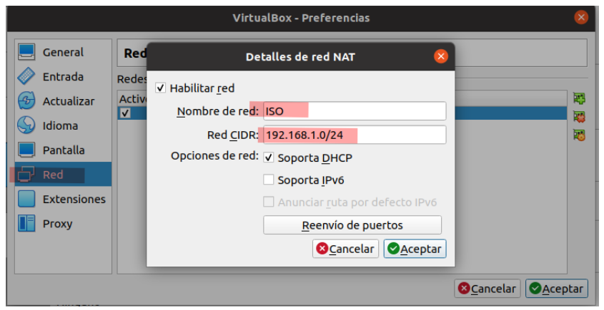
  

5 - ➕ Añadir máquina a la red : 

Una vez creada la red ``NAT``, se debe añadir la máquina virtual para que forme parte de la infraestructura de red y pueda comunicarse con otros equipos y servicios.

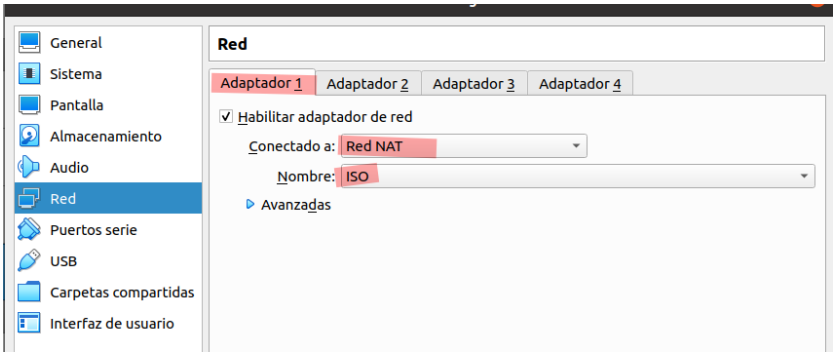
  

## 🌐 2. Configuración del Dominio
 

### 🚦 2.1 Primer Paso
 

🌍 Configuración de IP : 

Asignar una ``ip`` estática, puerta de enlace y máscara de subred es esencial para la correcta comunicación del servidor dentro de la red. El primer servidor ``dns`` será el mismo Controlador de Dominio.

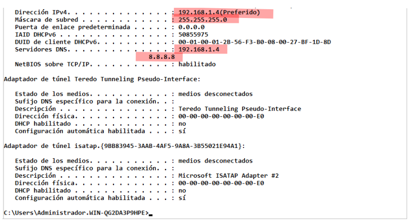
  

### 🏗️ 2.2 Instalar Dominio raíz
 

1 - Para comenzar, se deben instalar los roles esenciales: Servicios de dominio de Active Directory y Servidor DNS. Estos servicios permiten la gestión centralizada del dominio y la resolución de nombres.

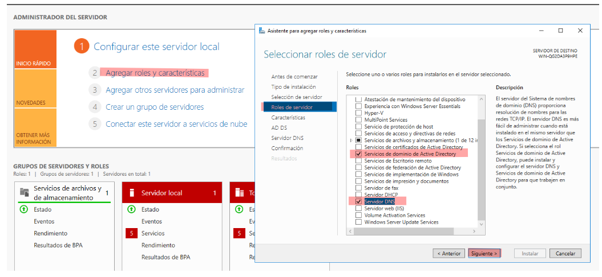
  

2 - 🚀 Promover el servidor a Control de dominio:

En el administrador del servidor, aparece un símbolo amarillo indicando la necesidad de promover el servidor a Controlador de Dominio. Se debe hacer clic en ``Promover`` para continuar.

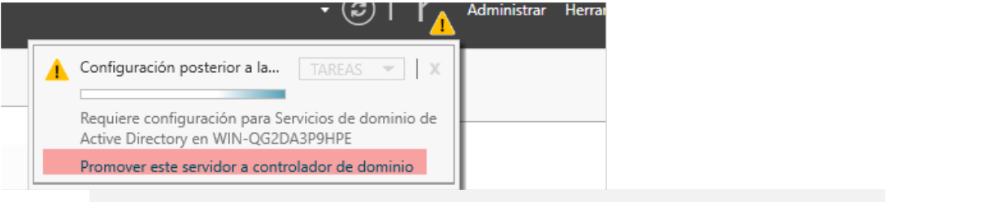
  

3 - ⚙️ Configurar implementación:

Se debe seleccionar la opción Agregar un nuevo bosque y definir el nombre del dominio, en este caso ``asir.local``. Esto crea la estructura principal para la gestión del dominio.

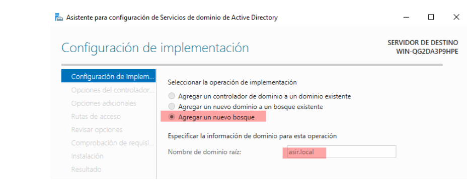
  

4 - 🔧 Opciones de Controlador

Aquí configuramos opciones avanzadas, como activar el servicio ``DNS`` y el ``Catálogo Global``, que contiene todas las reglas y políticas del dominio. 

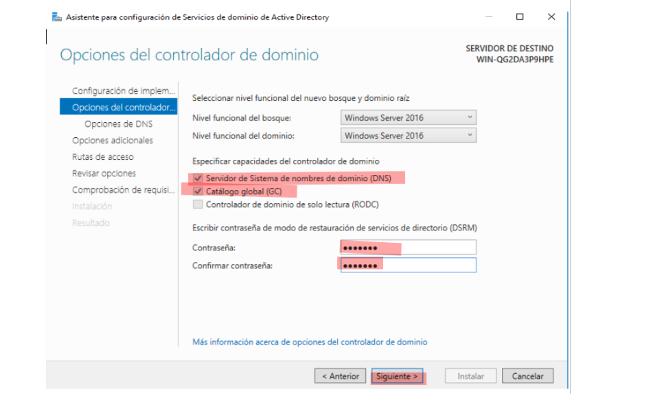
  

5 - Tras la configuración, se reinicia el servidor y se verifica que el dominio ha sido creado exitosamente.

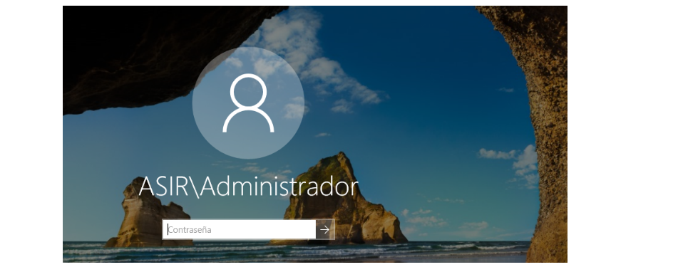
  

## ✅ 3. Comprobaciones 
 

1 - 🗺️ Acceder a Sitios y servicios de Active Directory

Esta consola permite visualizar y administrar los sitios dentro del dominio, facilitando la organización geográfica y lógica de los recursos de red.

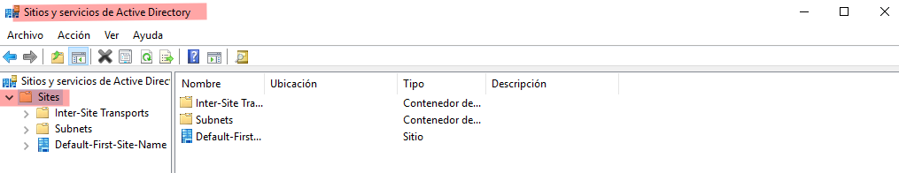
  

2 - 🔐 Acceder a Dominios y confianza de Active Directory

Aquí se configuran y gestionan las relaciones de confianza entre dominios, permitiendo que usuarios y recursos de dominios diferentes puedan interactuar.

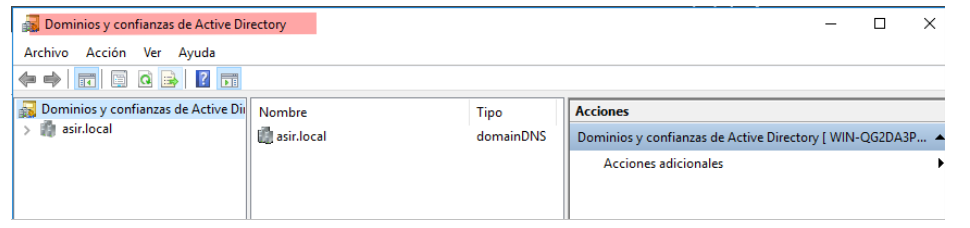
  

3 - 👥 Acceder a Usuarios y equipos de Active Directory

Esta herramienta permite administrar las cuentas de usuario, grupos y equipos dentro del dominio, estableciendo permisos y políticas de seguridad.

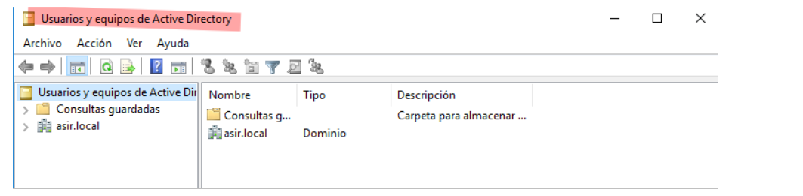