# 📦 Instalador de Controlador de Dominio en PowerShell 
 

**📑 Indice**
- [📦 Instalador de Controlador de Dominio en PowerShell](#-instalador-de-controlador-de-dominio-en-powershell)
  - [💡 Qué es PowerShell](#-qué-es-powershell)
  - [🖥️ 1. Máquina Virtual](#️-1-máquina-virtual)
    - [⚙️ 1.1 Configuración](#️-11-configuración)
  - [🌐 2. Creación de Dominio](#-2-creación-de-dominio)
    - [🛠️ 2. Configuración](#️-2-configuración)
  - [✔️ 2. Comprabar Dominio](#️-2-comprabar-dominio)

 

## 💡 Qué es PowerShell
 

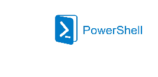

``PowerShell`` es una consola interactiva diseñada por Microsoft para administrar sistemas y automatizar tareas mediante comandos y scripts. Es muy utilizada por administradores de sistemas para gestionar entornos Windows de forma eficiente.
  
- Lanzada el 14 de noviembre de 2006 bajo licencia MIT.
- [Más información](https://es.wikipedia.org/wiki/PowerShell)

 

## 🖥️ 1. Máquina Virtual
 

### ⚙️ 1.1 Configuración
 

1 - Nombre:

Añadimos el nombre de la máquina virtual 

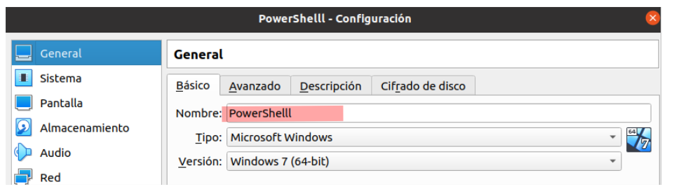
  

2 - Creacion de Red NAT:

Creamos una red ``NAT`` para conectar nuestra máquina virtual a la red local y permitir el acceso a internet.

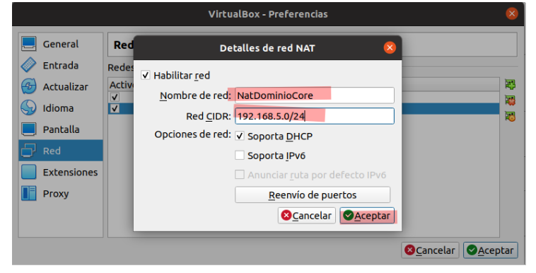
  

3 - Conectamos la máquina virtual a la red ``NAT`` recién creada para que forme parte de la red.

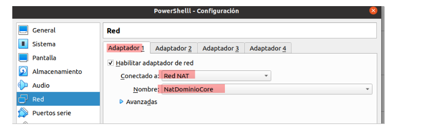
  

## 🌐 2. Creación de Dominio
 

### 🛠️ 2. Configuración 
 

1 -  Seleccionar adaptador de red:

Seleccionamos el adaptador de red para la configuración de ``ip`` y ``dns``

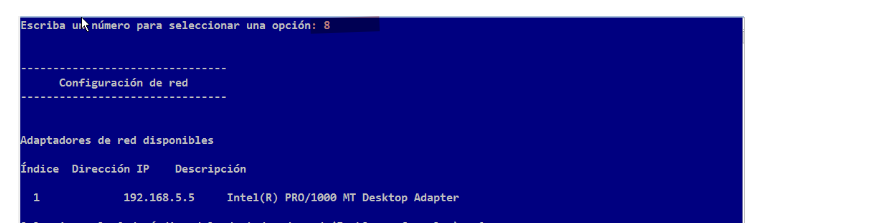
  

2 - Configurar IP:

Asignamos la dirección ``ip``, máscara de subred y puerta de enlace según la configuración de red.

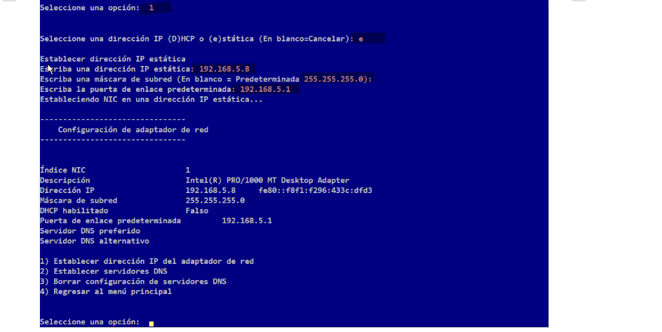
  

3 - Añadir DNS:

Configuramos el servidor ``dns`` para que el dominio funcione correctamente dentro de la red.

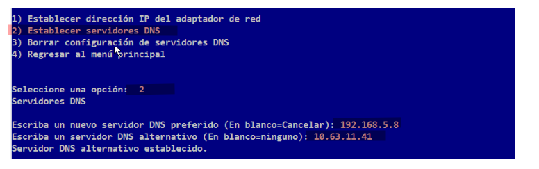
  

4 - Comprobamos la configuración de la red 

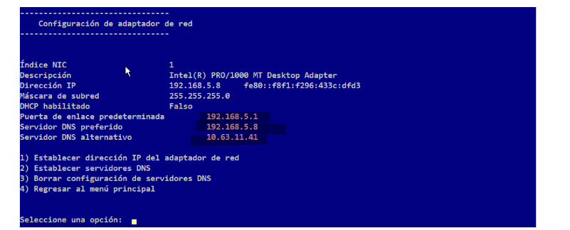
  

5 - Instalar Dominio Raíz:

Ejecutamos el siguiente comando para instalar el rol de ``Servicios de Dominio de Active Directory (AD DS)``:

~~~
Install-AdsForest AD-Domain-Services
~~~

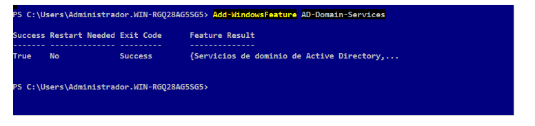
  

6 - Descargar servicios de dominio y DNS:

Descargamos el instalador para el dominio raíz con el nombre del dominio que vamos a usar:

~~~
Install-AdsForest -domainname asir.local
~~~

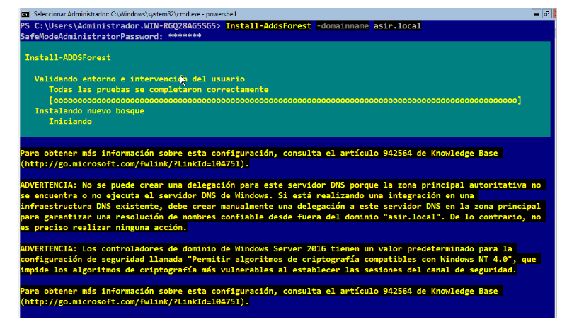
  

7 - Reiniciar máquina:

Después de instalar los servicios, el sistema se reinicia automáticamente para aplicar los cambios.

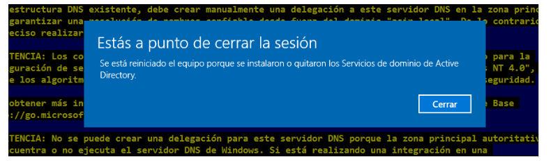
  

## ✔️ 2. Comprabar Dominio
 

Verificar ``ip``:

Finalmente, verificamos la configuración de ``ip`` con el siguiente comando:

~~~
ipconfig /all
~~~

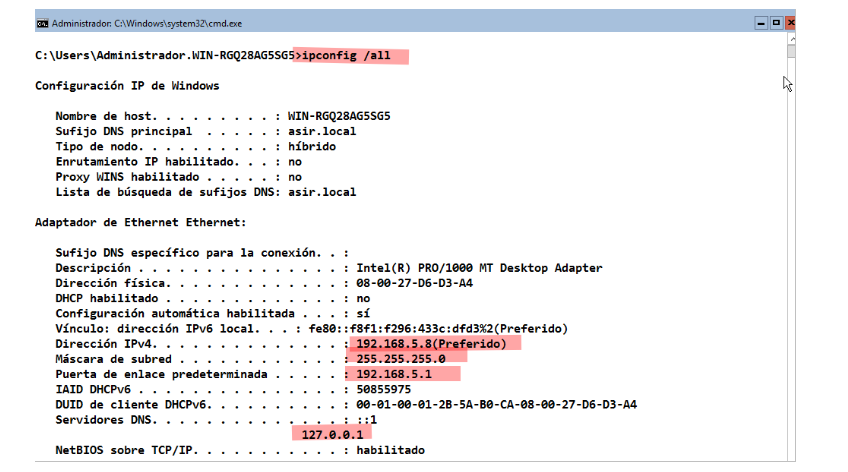