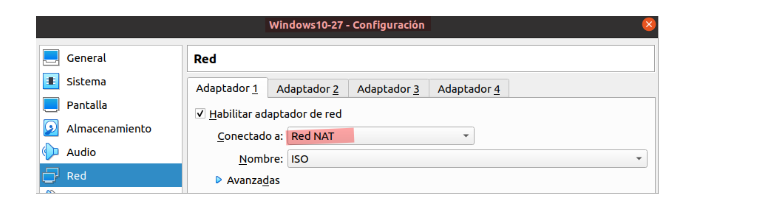
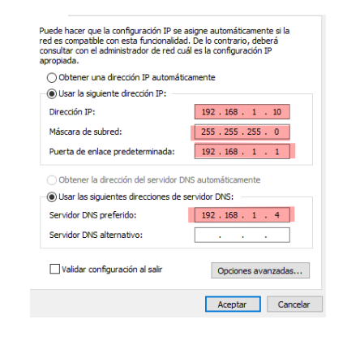
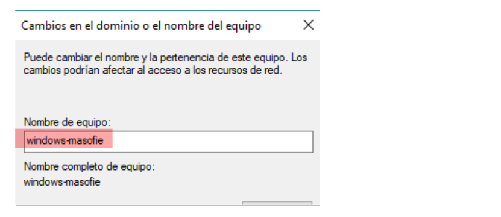
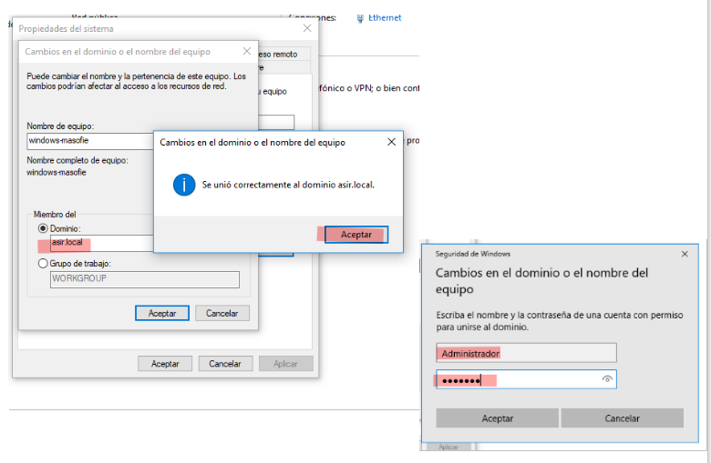
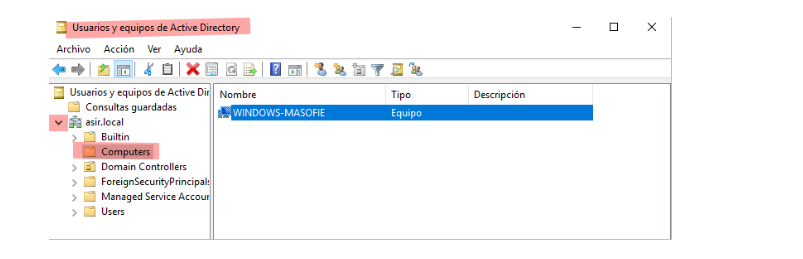
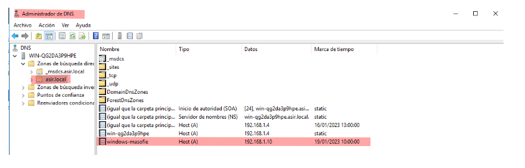
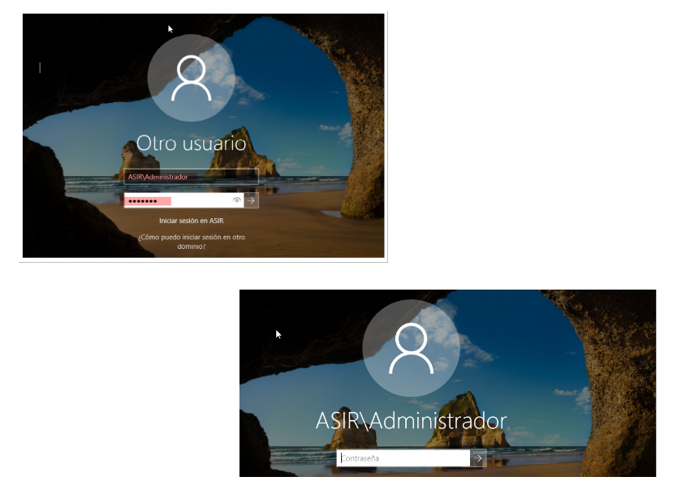
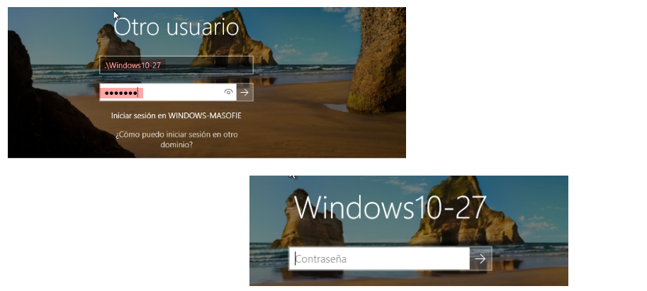

# 🖥️ Unir un equipo de Windows al Domino 
 

**📑 Indice**
- [🖥️ Unir un equipo de Windows al Domino](#️-unir-un-equipo-de-windows-al-domino)
  - [🔧 1. Maquina Virtual](#-1-maquina-virtual)
    - [⚙️ 1.2 Configuración](#️-12-configuración)
  - [🛠️ 2. Configuración y Unión del Dominio](#️-2-configuración-y-unión-del-dominio)
    - [🚀 2.1 Primer Paso](#-21-primer-paso)
    - [🤝 2.2 Unir Equipo](#-22-unir-equipo)
    - [🔍 2.3 Comprobación desde el Servidor](#-23-comprobación-desde-el-servidor)
    - [🕵️ 2.4 Comprobación desde el Cliente](#️-24-comprobación-desde-el-cliente)

 

## 🔧 1. Maquina Virtual 
 

### ⚙️ 1.2 Configuración 
 

1 - Crear una máquina Windows 10: 

Primero, creamos una máquina virtual con Windows 10 que será unirse al dominio.

  

2 - Conectar máquina a la Red:

Luego, conectamos la máquina virtual a la red donde está el servidor del dominio para asegurar la comunicación entre ellos.

  

## 🛠️ 2. Configuración y Unión del Dominio
 

### 🚀 2.1 Primer Paso
 

1 - Configurar IP de la máquina:

Asignamos una ``ip`` fija a la máquina Windows 10, asegurándonos que esté en la misma subred que el servidor del dominio. El servidor DNS preferido debe apuntar al servidor del dominio para resolver correctamente las peticiones.

  

2 -  Cambiar nombre del equipo:

Modificamos el nombre del equipo para identificarlo fácilmente dentro del dominio y la red.

  

### 🤝 2.2 Unir Equipo
 

1 - Procedemos a unir el equipo Windows 10 al dominio, ingresando el nombre del dominio y las credenciales del administrador de dominio para autorizar la unión.

  

### 🔍 2.3 Comprobación desde el Servidor 
 

1 - Acceder a Usuarios y equipos de Active Directory:

Verificamos que el equipo Windows 10 aparezca correctamente listado en la consola de Usuarios y Equipos de Active Directory.

  

2 - Acceder a Administrador de DNS:

Comprobamos en el Administrador de ``dns`` que el registro del equipo Windows 10 exista para garantizar la correcta resolución de nombres.

  

### 🕵️ 2.4 Comprobación desde el Cliente
 

1 -  Iniciar en Windows 10 como Administrador:

Para iniciar sesión en el equipo unido al dominio, usamos la cuenta de administrador del dominio con la siguiente sintaxis

~~~
ASIR\Administrador
~~~

  

2 - Iniciar sesión con Windows 10 como usuario ``admin``:

Finalmente, iniciamos sesión en Windows 10 con el usuario administrador para comenzar a usar el equipo dentro del dominio.

~~~
.\Windows10-27
~~~

