# 🗄️ Instalación de DC Adicional
 

**📑 Indice**
- [🗄️ Instalación de DC Adicional](#️-instalación-de-dc-adicional)
  - [🤔 Qué es un Dominio Adicional?](#-qué-es-un-dominio-adicional)
  - [🖥️ 1. Máquina Virtual](#️-1-máquina-virtual)
    - [⚙️ 1.1 Configuración](#️-11-configuración)
  - [🛠️ 2. Configuración del Dominio](#️-2-configuración-del-dominio)
    - [📝 2.1 Configuración Básica](#-21-configuración-básica)
  - [📦 2.2 Instalamos los Controladores](#-22-instalamos-los-controladores)
  - [🚀 3. Promover el Servidor](#-3-promover-el-servidor)
    - [🔧 3.1 Configuración](#-31-configuración)
  - [🔍 4. Acceder a los Controladores](#-4-acceder-a-los-controladores)
    - [👥 4.1 Usuarios y Equipos de Active Directory](#-41-usuarios-y-equipos-de-active-directory)
    - [💻 4.2 Configuración de los Clientes](#-42-configuración-de-los-clientes)
    - [➕ 4.3 Crear Nuevo Usuario](#-43-crear-nuevo-usuario)

 

## 🤔 Qué es un Dominio Adicional? 

Un ``Dominio Adicional`` es una copia exacta del ``Dominio Principal`` que permite la redundancia.
Si el servidor principal falla, el secundario toma el relevo.
Esto mejora la disponibilidad y el rendimiento del dominio.

 

## 🖥️ 1. Máquina Virtual
 

### ⚙️ 1.1 Configuración
 

1 - Creamos una nueva máquina de Windows Server . En ``VirtualBox`` creamos la máquina para el servidor adicional.

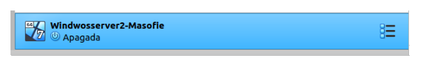
  

2 - Conectamos la máquina a la misma red del servidor principal.

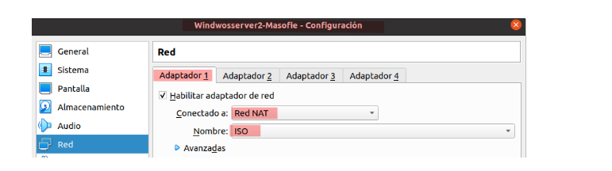
  

## 🛠️ 2. Configuración del Dominio 
 

### 📝 2.1 Configuración Básica 
 

1 - Configurar ``ip`` del Equipo:

Configuramos la ``ip`` . El servidor preferido será el principal, el secundario es este servidor adicional.

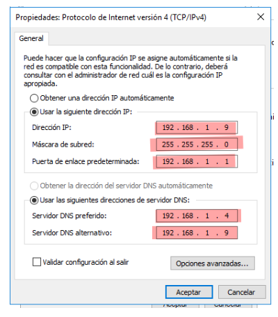
  

2 - Cambiar nombre del equipo:

Cambiamos el nombre para identificarlo fácilmente. Se reinicia la máquina para aplicar cambios.

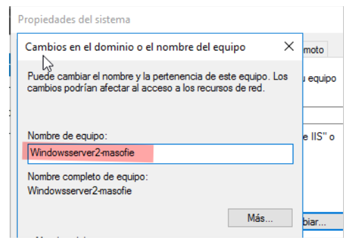
  

## 📦 2.2 Instalamos los Controladores
 

1 - Instalamos Active Directory Domain Services y DNS para que se comunique con el servidor principal.

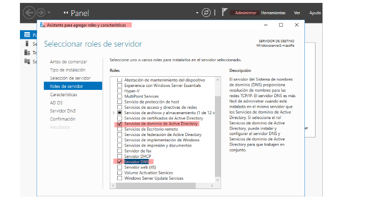
  

## 🚀 3. Promover el Servidor
 

### 🔧 3.1 Configuración
 

1 - Promovemos el servidor desde el aviso en la barra de tareas ``⚠️``

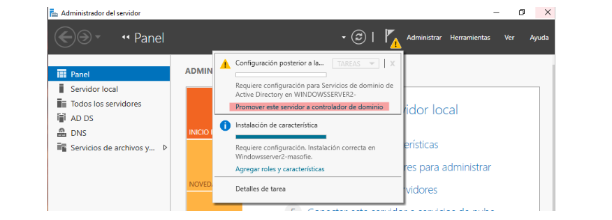
  

2 - Seleccionar implementación

- 1️⃣ Elegimos Agregar un controlador de dominio a un dominio existente.
- 2️⃣ Escribimos el nombre del dominio principal. 
 

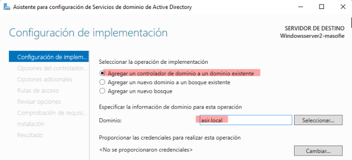
  

3 - Contraseña de dominio principal:

Ingresamos la contraseña de administrador del dominio 

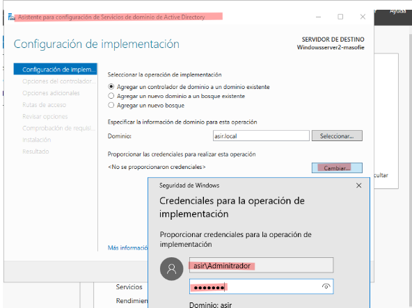
  

4 - Configuración de Implementación:

Indicamos el nombre del servidor principal en opciones adicionales.

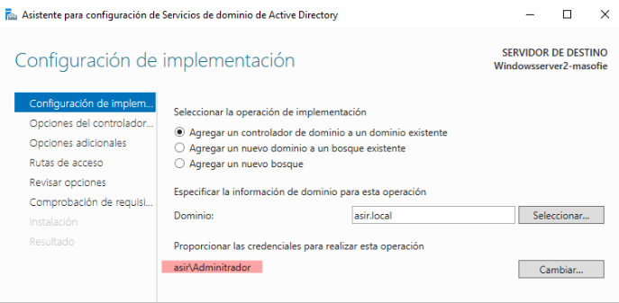
  

5 - Contraseña para dominio secundario:

Ingresamos la contraseña para el dominio secundario e incluimos el Catálogo Global (GC).

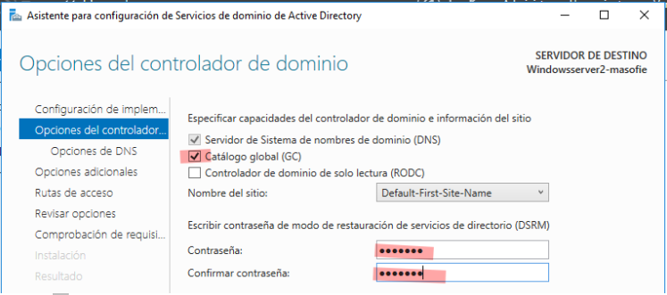
  

6 - Opciones adicionales:

Indicamos el nombre del servidor principal en opciones adicionales.

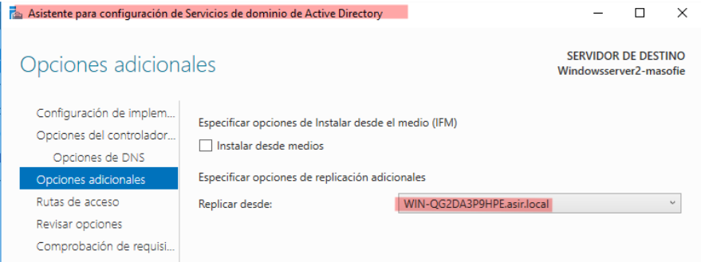
  

7 - Comprobar instalación:

Reiniciamos el servidor adicional. Verificamos que se haya unido correctamente al dominio.

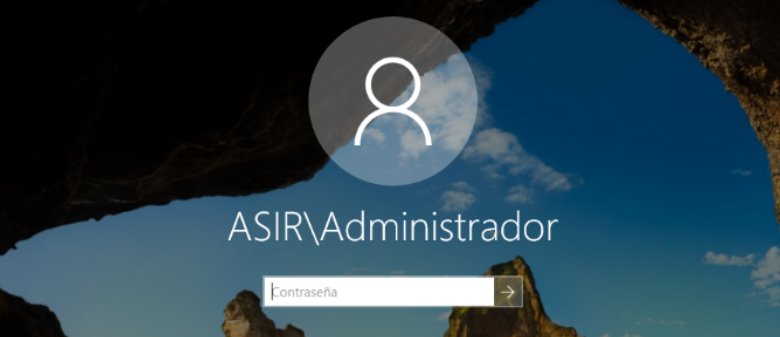
  

##  🔍 4. Acceder a los Controladores
 

### 👥 4.1 Usuarios y Equipos de Active Directory
 

1 - Desde el servidor principal y verificamos que ambos controladores estén visibles.

  

2 - Hacemos lo mismo para  con el adicional 

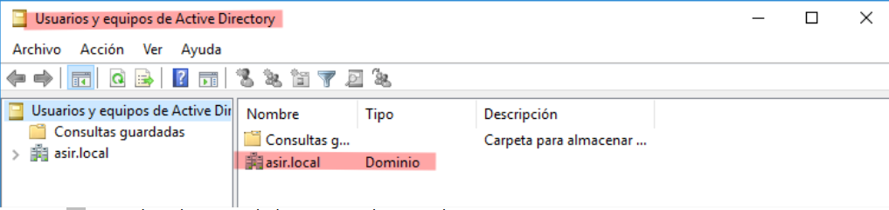
  

### 💻 4.2 Configuración de los Clientes
 

1 - Configuramos el DNS secundario en clientes Windows y Ubuntu con la IP del servidor adicional.

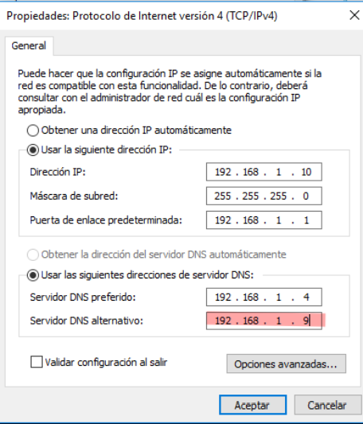
  

2 - Apagamos el servidor principal y comprobamos que el inicio de sesión siga funcionando.

  

### ➕ 4.3 Crear Nuevo Usuario
 

``¿Qué ocurre si creamos un usuario en DC adicional y luego arrancamos el principal``

1 - Crear nuevo usuario:

Creamos un usuario en el controlador adicional.

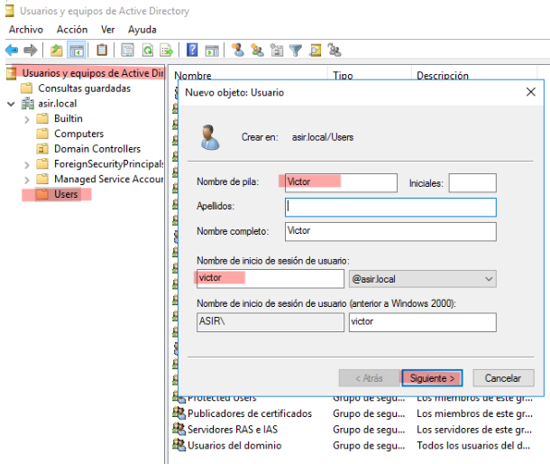
  

2 - Asignar contraseña:

Le asignamos contraseña y bloqueamos el cambio por parte del usuario.

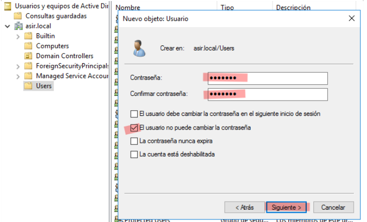
  

3 - Usuario creado:

Usuario creado correctamente.

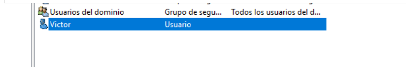
  

4 - Ver usuario en Active Directory:

Verificamos el usuario en el directorio activo.

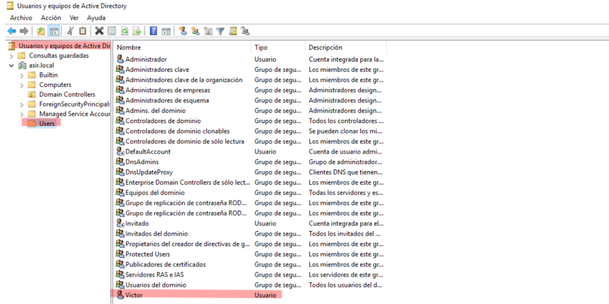